# Marvel Snap Project
In this Marvel Snap Game Project is to build a back end clone of Marvel Snap.

## Overview
### What is the purpose of the Project?
    Create a Lib that give any developers flexiblility to develop the marvel snap clone game

    Not Really into develop the game, but the end i will show you the game development using this library.

### Class Diagram
* Old Class Diagram, Created by: Deni Achmad

* New Class Diagram, by: ARW

```mermaid
classDiagram
class GameStatus {
    None
    Running
    Finished
}
class CardStatus {
    None
    OnDeck
    OnHand
    OnLocation
    OnGoing
    OnReveal
}
class CardAbility {
    None
    Destroy
    Discard
    Move
    OnGoing
    OnReveal
}
class LocationStatus {
    Hidden
    Revealed
}
class PlayerInfoSource {
    FromCard
    FromPower
    FromStatus
}
class PlayerStatus {
    None
    Win
    Lose
    Draw
}
class LocationAbility {
    None
    KunLun
    NegativeZone
    Ruins
}
class AbstractCard {
    <<Abstract>>
    +int Id [get; private set;]
    +string Name [get; private set;]
    +string Description [get; private set;]
    -int _cost
    -int _power
    +CardAbility CardAbility [get; private set;]
    -CardStatus _cardStatus
    -bool _isOnGoing
    -bool _isOnReveal
    +AbstractCard(int id, string name, string description, int cost, int power, CardAbilitycardAbility, CardStatus cardStatus, bool isOnGoing, bool isOnReveal)
    *AbstractCard Clone()
    *bool SpecialAbilityOnGoing(GameController game)
    *bool SpecialAbilityOnReveal(GameControllergame)
    +CardStatus GetCardStatus()
    +bool SetCardStatus(CardStatus status)
    +int GetCost()
    +bool SetCost(int cost)
    +int GetPower()
    +bool SetPower(int power)
    +bool IsDeployed()
    +bool virtual DeployCard(GameController game,IPlayer player, AbstractLocation location)
}
class AbstractLocation {
    <<Abstract>>
    +int Id [get; private set;]
    +string Name [get; private set;]
    +string Description [get; private set;]
    +LocationAbility LocationAbility [get; private set;]
    -LocationStatus _locationStatus
    -bool _isOnGoing
    -bool _isOnReveal
    -bool _isValid
    -List~AbstractCard~ _allCards
       -Dictionary~IPlayer, List~AbstractCard~~ _playersCards
    -Dictionary~IPlayer, int~ _playersPower
    -Dictionary~IPlayer, PlayerStatus~ _playersStatus
    +AbstractLocation(int id, string name, string description, LocationAbility ability, LocationStatus locationStatus, bool isOnGoing, bool isOnReveal, bool isValid)
    *bool SpecialAbilityOnGoing(GameController game)
    *bool SpecialAbilityOnReveal(GameController game)
    +bool virtual RegisterAbility(GameController game)
    +LocationStatus GetLocationStatus()
    +bool SetLocationStatus(LocationStatus status)
    +bool IsLocationValid()
    +bool SetLocationValid(bool valid)
    +List~AbstractCard~ GetAllCards()
    +bool AssignCardToLocation(params AbstractCard[] cards)
    +List~AbstractCard~ GetPlayerCards(IPlayer player)
    +Dictionary~IPlayer, List~AbstractCard~~ GetAllPlayersCards()
    +bool AssignPlayerCardToLocation(IPlayer player, AbstractCard card)
    +int GetPlayerPower(IPlayer player)
    +Dictionary~IPlayer, int~ GetAllPlayersPower()
    +bool AssignPlayerPower(IPlayer player, int power)
    +bool AddPlayerPower(IPlayer player, int powerToAdd)
    +bool AssignPlayer(params IPlayer[] players)
    +Dictionary~IPlayer, PlayerStatus~ GetAllPlayerStatus()
    +PlayerStatus GetPlayerStatus(IPlayer player)
    +bool SetPlayerStatus(IPlayer player, PlayerStatus playerStatus)
    +bool RemoveCardFromLocation(AbstractCard[] cards)
    +bool RemovePlayer(IPlayer[] players)
}
class IPlayer {
    <<Interface>>
    +int Id [get; private set;]
    +string Name [get; private set;]
}
class MSPlayer {
    +MSPlayer(int id, string name)
    +int GetHashCode()
    +bool Equals(object? obj)
}
class PlayerInfo {
    -List~AbstractCard~ _deck
    -List~AbstractCard~ _handCards
    -int _energy
    -int _maxDeck
    -int _totalWin
    -PlayerStatus _playerStatus
    +PlayerInfo()
    +List~AbstractCard~ GetDeck()
    +bool IsDeckFull()
    +bool AssignCardToDeck(params AbstractCard[] cards)
    +bool RemoveCardFromDeck(params AbstractCard[] cards)
    +List~AbstractCard~ GetHandCards()
    +bool AssignCardToHand(params AbstractCard[] cards)
    +bool RetrieveCardFromHand(params AbstractCard[] cards)
    +int GetEnergy()
    +bool SetEnergy(int energy)
    +int GetMaxDeck()
    +bool SetMaxDeck(int maxDeck)
    +int GetTotalWin()
    +bool AddTotalWin()
    +bool AddTotalWin(int addWin)
    +bool SetTotalWin(int totalWin)
    +PlayerStatus GetPlayerStatus()
    +bool SetPlayerStatus(PlayerStatus status)
}
class QuickSilver {
    +QuickSilver()
    +AbstractCard Clone()
    +bool SpecialAbilityOnGoing(GameController game) : false
    +bool SpecialAbilityOnReveal(GameController game) : false
}
class Hawkeye {
    -int _roundDeployed
    -AbstractLocation _locationDeployed
    -IPlayer _deployer
    +Hawkeye()
    +AbstractCard Clone()
    +bool SpecialAbilityOnGoing(GameController game) : false
    +bool SpecialAbilityOnReveal(GameController game) : true
    +bool DeployCard(GameController game, IPlayer player, AbstractLocation location)
    +int GetRoundDeployed()
    +bool SetRoundDeployed(int round)
    +AbstractLocation GetLocationDeployed()
    +bool SetLocationDeployed(AbstractLocation location)
    +IPlayer GetDeployer()
    +bool SetDeployer(IPlayer player)
    +void RegisterSpecialAbilityOnReveal(GameController game)
    }
class IronMan {
    -AbstractLocation _locationDeployed
    -IPlayer _deployer
    +IronMan()
    +AbstractCard Clone()
    +bool SpecialAbilityOnGoing(GameController game) : true
    +bool SpecialAbilityOnReveal(GameController game) : false
    +bool DeployCard(GameController game, IPlayer player, AbstractLocation location)
    +AbstractLocation GetLocationDeployed()
        +bool SetLocationDeployed(AbstractLocation location)
    +IPlayer GetDeployer()
    +bool SetDeployer(IPlayer player)
    +void RegisterSpecialAbilityOnGoing(GameController game)
}
class GameController {
    -readonly Logger _logger
    -GameStatus _gameStatus
    -int _round
    -int _maxRound
    -Dictionary~IPlayer, PlayerInfo~ _players
    -List~AbstractLocation~ _locations
    -int _maxLocation
    -List~AbstractLocation~ _allLocations
    -List~AbstractCard~ _allCards
    -IPlayer _currentTurn
    -IPlayer _winner
    +Action~AbstractCard, CardStatus~ OnCardStatusUpdate
    +Action~AbstractLocation, LocationStatus~ OnLocationStatusUpdate
    +Action~IPlayer, PlayerStatus~ OnPlayerStatusUpdate
    +Action~AbstractLocation~ OnLocationUpdate
    +Action~IPlayer, PlayerInfo~ OnPlayerUpdate
    +event Func~GameController, bool~ OnRevealCardAbilityCall
    +event Func~GameController, bool~ OnRevealLocationAbilityCall
    +event Func~GameController, bool~ OnGoingCardAbilityCall
    +event Func~GameController, bool~ OnGoingLocationAbilityCall
    +GameController(Logger? log = null)
    +void StartGame()
    +void EndGame()
    +GameStatus GetCurrentGameStatus()
    +bool SetGameStatus(GameStatus status)
    +int GetCurrentRound()
    +bool NextRound(int round)
    +bool NextRound(int round, bool plain)
    +bool NextRound()
    +bool NextRound(bool plain)
    +bool HiddenLocation(AbstractLocation location)
    +bool RevealLocation(AbstractLocation location)
    +bool RevealLocation(int index, bool isLoop = false)
    +int GetMaxRound()
    +bool SetMaxRound(int maxround)
    +Dictionary~IPlayer, PlayerInfo~ GetAllPlayersInfo()
    +List~IPlayer~ GetAllPlayers()
    +IPlayer GetPlayer(IPlayer player)
    +IPlayer GetPlayer(int index)
    +PlayerInfo GetPlayerInfo(IPlayer player)
    +bool AssignPlayer(params IPlayer[] players)
    +bool RemovePlayer(params IPlayer[] players)
    +List<AbstractCard> GetPlayerDeck(IPlayer player)
    +AbstractCard GetPlayerCardInDeck(IPlayer player, AbstractCard card, bool byName = true)
    +bool AssignCardToPlayerDeck(IPlayer player, params AbstractCard[] cards)
    +bool AssignCardToPlayerDeck(IPlayer player, bool clone = true, bool byName = true, params AbstractCard[] cards)
    +bool RemovePlayerCardFromDeck(IPlayer player, params AbstractCard[] cards)
    +List~AbstractCard~ GetPlayerHand(IPlayer player)
    +AbstractCard GetPlayerCardInHand(IPlayer player, AbstractCard card, bool byName = true)
    +bool AssignCardToPlayerHand(IPlayer player, params AbstractCard[] cards)
    +bool AssignCardToPlayerHand(IPlayer player, bool fromDeck = true, bool byDeckName = true, bool clone = true, bool byName = true, params AbstractCard[] cards)
    +bool RemovePlayerCardFromHand(IPlayer player, params AbstractCard[] cards)
    +int GetPlayerEnergy(IPlayer player)
    +bool SetPlayerEnergy(int energy)
    +bool SetPlayerEnergy(IPlayer player, int energy)
    +bool AddPlayerEnergy(IPlayer player)
    +bool AddPlayerEnergy(IPlayer player, int addEnergy)
    +int GetPlayerMaxDeck(IPlayer player)
    +bool SetPlayerMaxDeck(IPlayer player, int maxDeck)
    +int GetPlayerTotalWin(IPlayer player)
    +bool SetPlayerTotalWin(IPlayer player, int totalWin)
    +bool AddPlayerTotalWin(IPlayer player)
    +bool AddPlayerTotalWin(IPlayer player, int addWin)
    +PlayerStatus GetPlayerStatus(IPlayer player)
    +bool SetPlayerStatus(IPlayer player, PlayerStatus status)
    +List~AbstractLocation~ GetAllDeployedLocations()
    +AbstractLocation GetDeployedLocation(AbstractLocation location, bool byName = true)
    +AbstractLocation GetDeployedLocation(int index)
    +bool AssignLocation(params AbstractLocation[] locations)
    +bool RemoveLocation(params AbstractLocation[] locations)
    +LocationStatus GetLocationStatus(AbstractLocation location)
    +bool SetLocationStatus(AbstractLocation location, LocationStatus status)
    +bool IsLocationValid(AbstractLocation location)
    +bool SetLocationValid(AbstractLocation location, bool isValid)
    +List<AbstractCard> GetAllCardsInLocation(AbstractLocation location)
    +AbstractCard GetCardInLocation(AbstractLocation location, AbstractCard card, bool byName = true)
    +AbstractCard GetCardInLocation(AbstractLocation location, int index)
    +bool AssignCardToLocation(AbstractLocation location, params AbstractCard[] cards)
    +bool RemoveCardFromLocation(AbstractLocation location, params AbstractCard[] cards)
    +Dictionary~IPlayer, List~AbstractCard~~ GetPlayerCardInLocation(AbstractLocation location)
    +List~AbstractCard~ GetPlayerCardInLocation(IPlayer player, AbstractLocation location)
    +bool AssignPlayerToLocation(AbstractLocation location, params IPlayer[] players)
    +bool RemovePlayerFromLocation(AbstractLocation location, params IPlayer[] players)
    +Dictionary~IPlayer, int~ GetPlayerPowerInLocation(AbstractLocation location)
    +int GetPlayerPowerInLocation(IPlayer player, AbstractLocation location)
    +bool AssignPlayerPowerToLocation()
    +bool AssignPlayerPowerToLocation(IPlayer player, AbstractLocation location, int power)
    +bool AddPlayerPowerToLocation(IPlayer player, AbstractLocation location)
    +bool AddPlayerPowerToLocation(IPlayer player, AbstractLocation location, int powerToAdd)
    +Dictionary~IPlayer, PlayerStatus~ GetPlayerStatusInLocation(AbstractLocation location)
    +PlayerStatus GetPlayerStatusInLocation(IPlayer player, AbstractLocation location)
    +bool SetPlayerStatusInLocation(IPlayer player, AbstractLocation location, PlayerStatus status)
    +List~IPlayer~ GetAllPlayersInLocation(AbstractLocation location, PlayerInfoSource infoSource = PlayerInfoSource.FromCard)
    +IPlayer GetPlayerInLocation(AbstractLocation location, IPlayer player)
    +IPlayer GetPlayerInLocation(AbstractLocation location, int index)
    +int GetMaxLocation()
    +bool SetMaxLocation(int maxLocation)
    +List~AbstractLocation~ GetDefaultAllLocations()
    +bool SetDefaultAllLocations(params AbstractLocation[] locations)
    +List~AbstractCard~ GetDefaultAllCards()
    +bool SetDefaultAllCards(params AbstractCard[] cards)
    +AbstractCard GetShuffleCard()
    +AbstractLocation GetShuffleLocation()
    +int GetShuffleIndex(int max)
    +bool AssignPlayerCardToLocation(IPlayer player, AbstractCard card, AbstractLocation location)
    +bool AssignPlayerCardToLocation(IPlayer player, AbstractCard card, AbstractLocation location, bool fromHand = true, bool byHandName = true, bool clone = true, bool byName = true, bool registerAbility = false, bool usingEnergy = true)
    +IPlayer GetCurrentTurn()
    +bool NextTurn(IPlayer player)
    +bool NextTurn(int index)
    +bool NextTurn()
    +IPlayer GetWinner()
    +IPlayer FindWinnerInLocation(AbstractLocation location)
    +void FindWinnerInLocation()
    +IPlayer FindWinner()
    +bool SetWinner(IPlayer player)
}



MSPlayer ..|> IPlayer
QuickSilver --|> AbstractCard
Hawkeye --|> AbstractCard
IronMan --|> AbstractCard
GameController --* IPlayer
GameController --* PlayerInfo
GameController --* AbstractLocation
GameController --* AbstractCard
GameController ..> PlayerInfoSource
PlayerInfo --* IPlayer
PlayerInfo --* AbstractCard
AbstractLocation --* IPlayer
AbstractLocation --* AbstractCard
AbstractCard ..> CardAbility
AbstractCard ..> CardStatus
GameController ..> GameStatus
AbstractLocation ..> LocationAbility
AbstractLocation ..> LocationStatus
PlayerInfo ..> PlayerStatus
```

